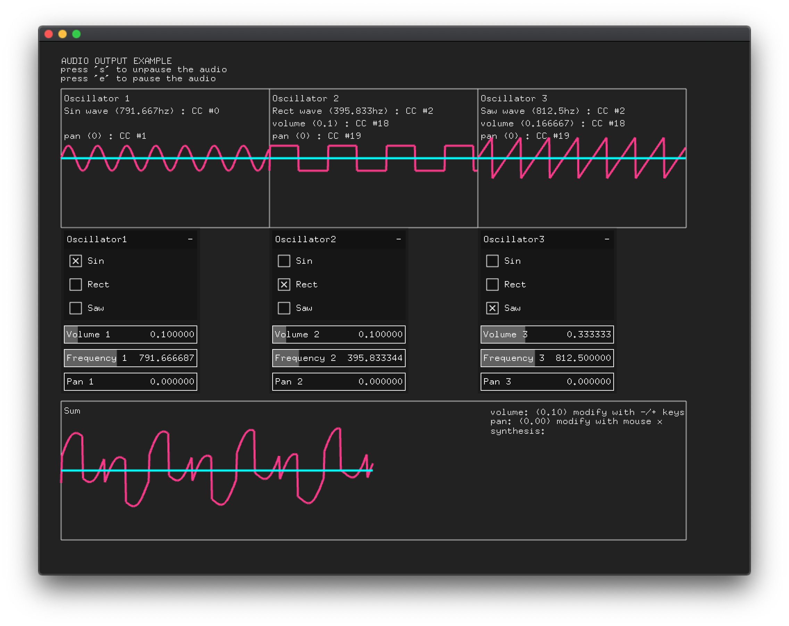
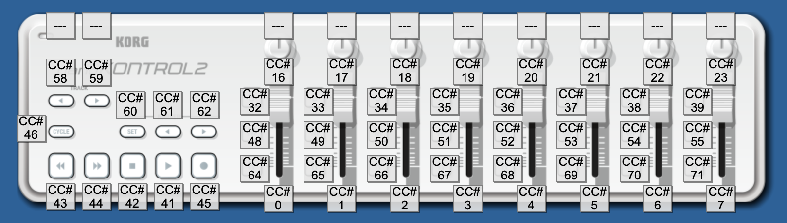

# Midi audio controller
This program was created with openframeworks.

It synthesizes the waves produced by the three oscillators and outputs them as audio.

It is assumed to run with nanoKONTROL2 from korg as a midi controller.

## Screenshot

